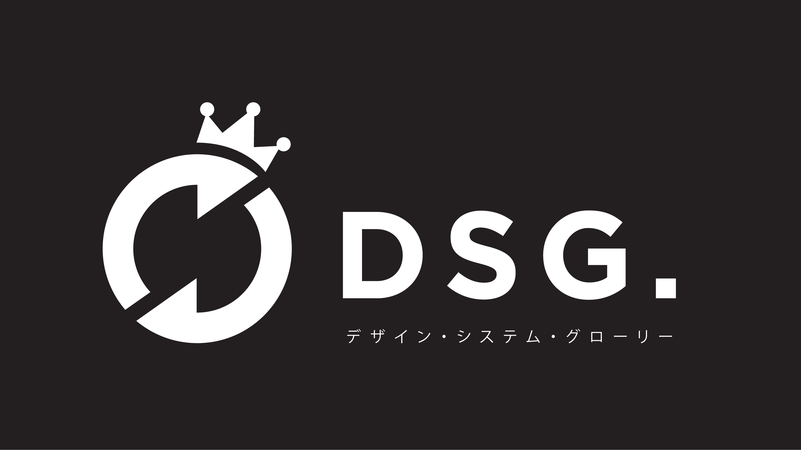

# Welcome to the team.

## Design team Rolling Glory terdiri dari:

**Creative Conceptor**  
Creative Conceptor \(CC\) adalah orang pertama yang akan menerima brief dari klien \(atau dari Account Manager\). Bersama dengan Account Manager, kamu bertanggung jawab dalam memberikan solusi kreatif untuk menjawab kebutuhan klien. Dalam merumuskan solusi kreatif ini, ada tahapan-tahapan yang harus kamu lakukan agar solusi yang kamu buat benar-benar tepat sasaran. Berikut dokumen yang harus kamu pelajari dan jadikan panduan dalam membuat solusi kreatif:



**Researcher**  
Halo Researcher! Di RGB belum ada role murni Researcher, jadi bisa dipastikan kamu mempunyai Role lain seperti UX Designer atau UI Designer. Tugas Researcher yang utama adalah membantu Account Manager \(AM\) atau Creative Conceptor \(CC\) untuk mencari dan mengumpulkan data mengenai klien/project/product baru yang sedang dikerjakan. Output yang harus kamu buat adalah Document Findings, dalam melakukan tugasmu, kamu harus mempelajari Research Pipeline & Guideline berikut:



**UX Designer**  
Halo UX, tugas dan tanggung jawab utamamu adalah membuat rancangan flow, wireframe serta prototype dari solusi yang sudah dirancang oleh Creative Conceptor. Tentunya kamu akan diajak brainstorm dengan Creative Conceptor yang sudah membawa konsep tersebut. Dalam membuat wireframe, kamu harus mempertimbangkan banyak hal, salah satunya adalah Information Architecture Beberapa hal yang biasa kami pertimbangkan sebelum memulai membuat user flow.





**UI Designer**  
Setelah UX designer sudah selesai membuat user flow dan wireframe. Tugas kamu sebagai UI Designer untuk membuat finalisasi desain berupa mock up dan prototype. Berikut hal yang perlu dipertimbangkan sebelum kamu mendesain.



