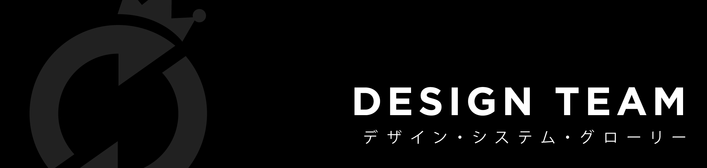
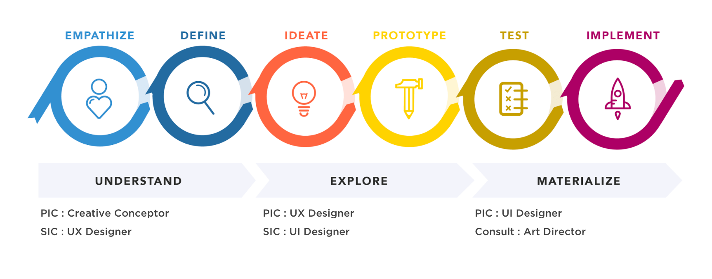

# Designer Onboarding

## Values in Design Team

Tentu saja kita mengaplikasikan value yang sama seperti yang perusahaan terapkan yaitu; Kindness & Care, Opennes, dan Mutual Trust.

## Design Team Culture

Secara umum, design team menerapkan proses _design thinking_ pada setiap project. Proses pertama yang paling penting sebelum mendesain adalah berempati. Kami percaya proses berempati yang baik akan menghasilkan insight yang tepat untuk development product. Untuk itu, kamu harus mempunyai gambaran bagaimana klien menjalankan bisnisnya dan apa yang user butuhkan. 

Tim desain sering kali bertukar pikiran dalam sebuah wadah bernama designer talk. Designer talk dilakukan setiap minggu dengan topik pembahasan yang berbeda. Sering kali designer talk menjadi sebuah workshop ketika kami ingin belajar sesuatu yang baru. Tujuannya semua tim desain memiliki standard knowledge yang sama.  
  
Kami juga mendukung setiap coaster di tim desain untuk belajar hal baru. Perusahaan akan support jika coaster ingin mengikuti workshop, seminar atau short class yang bisa menambah skill dan knowledge desain mereka. Tentunya dengan satu syarat, setelah selesai mengikuti workshop, coaster tersebut wajib membagikan ilmu barunya pada coasters lainnya dalam sebuah sesi khusus designer talk.

## Roles in Design Team 

Design team terdiri dari roles yang cukup beragam, dan dengan tanggung jawab yang berbeda-beda. Pelajari masing-masing roles tersebut di sini:





