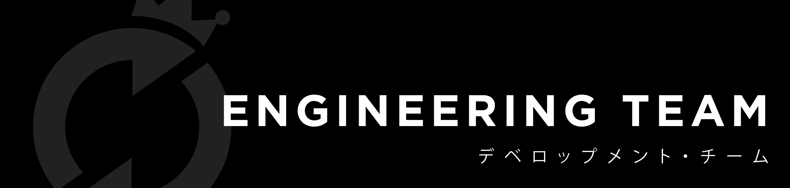

# Engineer Onboarding

## Values in Engineering Team

Tim engineering di Rolling Glory pun tentu saja juga menerapkan nilai-nilai Kindness & Care, Opennes, dan Mutual Trust.&#x20;

## Accountabilities & Responsibilities

Apakah ekspektasi Rolling Glory pada seorang coaster engineer? Semuanya tertuliskan di link Engineer Accountabilities & Responsibilities berikut:


[engineer.md](../organization/accountabilities-responsibilities/engineer.md)


Jika kamu seorang Tech Lead, baca ini juga:


[tech-lead.md](../organization/accountabilities-responsibilities/tech-lead.md)


## Convention as a Culture

Secara umum, salah satu _team culture_ dari tim engineering Rolling Glory adalah _convention_ / kesepakatan dan keseragaman dalam _coding,_ dimulai dari _best practice_, _coding style, IDE, framework / library_ yang dipakai, hingga hal-hal lain seperti API format. _Convention_ diberlakukan dengan tujuan untuk __ menyeragamkan banyaknya engineer dalam team maupun project yang dikerjakan dalam Rolling Glory.&#x20;

Kesepakatan yang sudah ditentukan sudah dipertimbangkan tidak hanya dari perspektif teknologi saja namun tentunya juga dari sisi bisnis, sisi solusi yang tepat guna, _maintainability_, _scalability_, dan lain-lain, karena pada hakikatnya tim engineering adalah bagian dari _production_ _pipeline_ keseluruhan yang bertujuan untuk membuat sebuah aplikasi sebagai sebuah solusi akan masalah yang ada. Dan tentu saja kesepakatan-kesepakatan ini pun akan berkembang seiring waktu dan perkembangan teknologi, jadi jika menemukan hal-hal apapun terkait _engineering_ yang lebih baik, _let's discuss_!

## General Convention

Best practice untuk Git Commit merupakan awal yang baik dan harus dimiliki seluru engineer di Rolling Glory, dilanjutkan dengan spesifikasi JSON API yang akan di-_develop_ ataupun akan di-_consume_.


[git-best-practice.md](../engineering-team/git-best-practice-1/git-best-practice.md)



[json-api-specification.md](../engineering-team/json-api-specification.md)


## Documentation for Specific Roles

Lalu silakan lanjut ke dokumentasi-dokumentasi yang relevan dengan role masing-masing.

### Web Developer


[javascript-coding-convention.md](../engineering-team/coding-convention/javascript-coding-convention.md)



[php-coding-convention.md](../engineering-team/coding-convention/php-coding-convention.md)


### Android Developer


[Broken link](broken-reference)



[Broken link](broken-reference)


### iOS Developer


[Broken link](broken-reference)


__
