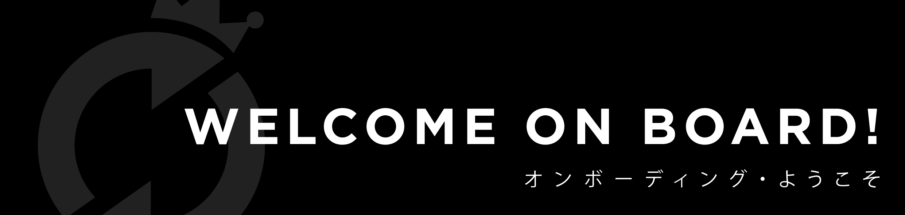

# New Coaster Onboarding

Banyak sekali hal-hal yang lebih baik kamu ketahui tentang Rolling Glory sebagai seorang Coaster. Mulai dari hal-hal remeh-temeh sehari-hari, _guideline policy_, _design system_, _code convention_, _team culture_, hingga filosofi dari berbagai macam hal di Rolling Glory.

## Baik, jadi dari mana Kak saya harus memulai?

### Glory Principles

Rolling Glory memiliki prinsip-prinsip yang dipegang teguh dan selalu berusaha untuk diamalkan setiap saat dalam kehidupan dalam studio, secara profesional maupun personal.

Principles ini terdiri dari **Mission & Vision**, **Values**, **Forte**, dan **Spirit**. Tentunya Rolling Glory tidak ingin prinsip-prinsip tersebut hanya menjadi jargon semata, oleh karena itu, ada section juga yang memuat contoh-contoh pengamalan dalam kehidupan sehari-hari juga.



### Organization Structure

Setelah meresapi Glory Principles, berikut adalah beberapa hal tentang struktur organisasi, filosofi maupun implementasinya:



#### Production Pipeline



### Jam Kerja dan Pengambilan Cuti

Nah, udah kebayang kan Rolling Glory seperti apa dan bagaimana cara kerjanya.

Berikut adalah hal-hal terkait Jam Kerja yang perlu kamu ketahui, lengkap dengan bagaimana terkait cuti dan cara mengajukan cuti jika dibutuhkan:



### Ekstra Kurikuler

Yap, seperti yang sudah disampaikan sebelumnya, kita di Rolling Glory tidak hanya bekerja bersama, tapi juga berkarya bersama, hidup bersama. 

Ada group-group di Telegram yang menaungi berbagai kesenangan, hobi, ataupun hal-hal lain, silakan cari apa yang cocok buat kamu dan pastikan kamu bergabung.

Wajib untuk join minimal 3 group yang sesuai dengan kamu ya:



## Sudah Kak, secara general sudah kebayang, lalu apalagi?

Sip, berikut silakan baca hal-hal di bawah ini sesuai dengan role kamu

### Project Manager



### Engineer



### Designer



### QA Tester



### Web Administrator



### 

