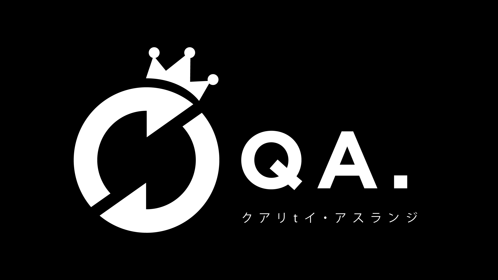

# QA Onboarding

## Values in QA Team

Tidak berbeda dengan Value RGB,  kita mengaplikasikan value yang sama seperti yang perusahaan terapkan yaitu; Kindness & Care, Opennes, dan Mutual Trust.

## General Briefing

Goal dari tim QA di RGB adalah memastikan project/product yang dikerjakan oleh tim development sudah pada kualitas **TERBAIK**.

Tim QA mempunyai tanggung jawab untuk melakukan testing dan pengecekan project/product secara menyeluruh sesuai dengan desain dan kebutuhan yang sudah disepakati. Pengecekan yang dilakukan meliputi

* Fitur
* Fungsionalitas
* UX \(User Experience\)
* UI \(User Interface\)

## Rolling Glory - Quality Assurance Guideline

Tim QA di RGB memiliki guideline yang dirancang berdasarkan Value dan General Briefing diatas. Detail guideline dapat diakses dengan membuka link dibawah ini.

Sebagai catatan: Guideline diatas akan selalu berada pada kondisi _**Beta**_. Tujuannya adalah agar guideline tersebut akan terus dikembangkan dan diperbaiki untuk menjadi guideline yang lebih baik dari waktu ke waktu.

