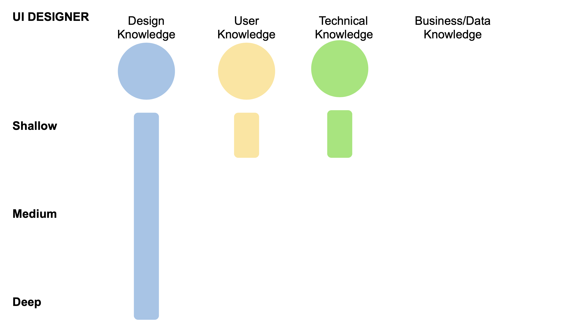
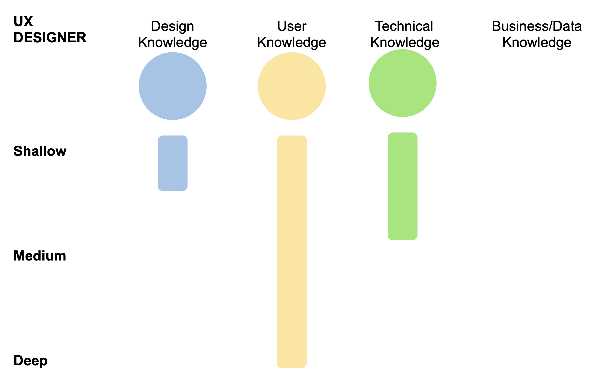
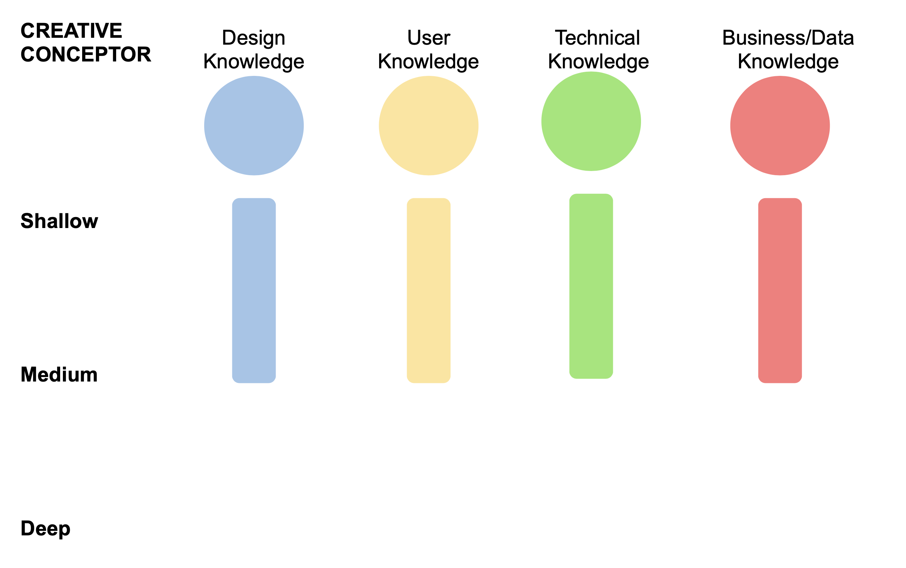

# Designer

Untuk melihat Panduan Roles Designer dan Responsibilites-nya bisa dilihat di sini



Di section ini lebih dibahas apa saja yang harus dipunyai oleh masing-masing roles

## UI Designer

Seorang UI designer **bertanggung jawab untuk mem-visualisasi-kan wireframe yang sudah dibuat supaya terlihat indah, cantik, dan sesuai dengan kebutuhan klien** \(sesuai dengan visual identity brand ataupun persona user\).

Sebagai UI designer kamu harus:

* Mempunyai pondasi knowledge yang kuat di **prinsip-pirinsip design/visual**
* **Bisa meng-implementasikan** prinsip-prinsip design/visual tersebut pada real case
* Bisa **memberikan rekomendasi** terbaik terhadap suatu issue berdasarkan prinsip-prinsip design/visual yang ada
* Mempunyai pondasi knowledge yang kuat dalam **membuat dokumen/presentasi yang menggambarkan rancangan/konsep visual**
* **Selalu mengupdate diri** dengan knowledge terbaru terkait prinsip-prinsip design/visual

Tambahan yang harus kamu punya:

* Little amount **knowledge of user**
* Little amount **knowledge of tech**

Berikut sedikit visualisasi trait/character yang dibutuhkan oleh UI designer

Di luar ini tentu saja kamu harus bisa mempraktekkan/mengamalkan glory principles:



## UX Designer

Seorang UX Designer **bertanggung jawab dalam membuat rancangan flow, wireframe, serta prototype click-able** dari solusi yang sudah dirancang.

sebagai UX designer kamu harus:

* Mempunyai pondasi knowledge yang kuat di **Design Thinking & Human Centered Design**
* **Bisa meng-implementasikan** prinsip-prinsip Design Thinking & HCD pada real case
* Curiosity dan Empathy yang tinggi pada **user/customer needs & behaviour**
* Mempunyai pondasi knowledge di **User Research & Testing**
* Pondasi knowledge yang kuat dalam membuat **Prototype**
* Mempunyai pondasi knowledge yang kuat dalam **membuat dokumen/presentasi yang menggambarkan rancangan**
* **Selalu mengupdate diri** dengan knowledge terbaru terkait prinsip-prinsip HCD

Tambahan yang harus kamu punya:

* Enough amount **knowledge of Tech**
* Little amount **knowledge of Design/Visual**

Berikut sedikit visualisasi trait/character yang dibutuhkan oleh UX Designer:

Di luar ini tentu saja kamu harus bisa mempraktekkan/mengamalkan glory principles:



## Creative Conceptor

Seorang Creative Conceptor mempunyai **tanggung jawab untuk memberikan solusi kreatif** dalam rangka menjawab kebutuhan klien, **sesuai dengan proses yang baik dan benar**. 



Sebagai CC kamu harus:

* Mempunyai: enough amount **knowledge of Design/Visual** principle
* Mempunyai: enough amount **knowledge of User behaviour** principle
* Mempunyai: enough amount **knowledge of Technical** sides
* Mempunyai: enough amount **knowledge of Business** sides
* Mempunyai **critical/analitycal thinking** yang kuat

Tambahan yang kamu harus punya:

* Mempunyai pondasi knowledge yang kuat dalam **membuat dokumen/presentasi yang menggambarkan solusi**

Berikut sedikit visualisasi trait/character yang dibutuhkan oleh Creative Conceptor:

Di luar ini tentu saja kamu harus bisa mempraktekkan/mengamalkan glory principles: 



## UX Writer

Seorang UX Writer **bertanggung jawab dalam membuat konten tekstual di dalam website/game/mobile app** agar mudah dipahami oleh pengguna

sebagai UX writer kamu harus:

* Mempunyai pondasi knowledge yang kuat di **Technical Writing**
* **Bisa meng-implementasikan** prinsip-prinsip Writing pada real case
* Curiosity dan Empathy yang tinggi pada **user/customer needs & behaviour**
* **Selalu mengupdate diri** dengan knowledge terbaru terkait prinsip-prinsip Writing

Tambahan yang harus kamu punya:

* Enough amount **knowledge of User behaviour**
* Little amount **knowledge of Design/Visual**
* Little amount **knowledge of Tech**

Berikut sedikit visualisasi trait/character yang dibutuhkan oleh UX Writer:

Di luar ini tentu saja kamu harus bisa mempraktekkan/mengamalkan glory principles: 



## UX Researcher

Seorang UX Researcher **bertanggung jawab dalam melakukan riset terhadap user ataupun project/product** yang sedang didevelop. ****UX researcher harus **membuat dokumen report** based on hasil riset nya.

sebagai UX Researcher kamu harus:

* Mempunyai pondasi knowledge yang kuat di **Design Thinking & Human Centered Design**
* Mempunyai pondasi knowledge yang kuat di **User Research & Testing**
* **Bisa meng-implementasikan** prinsip-prinsip Research pada real case
* Curiosity dan Empathy yang tinggi pada **user/customer needs & behaviour**
* Pondasi knowledge yang kuat dalam membuat **Dokumen dan Presentasi**
* **Selalu mengupdate diri** dengan knowledge terbaru terkait prinsip-prinsip Research

Tambahan yang harus kamu punya:

* Enough amount **knowledge of Tech**
* Little amount **knowledge of Design/Visual**

Berikut sedikit visualisasi trait/character yang dibutuhkan oleh UX Researcher:

