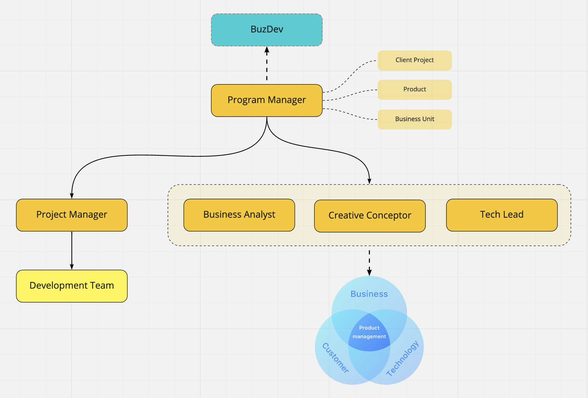
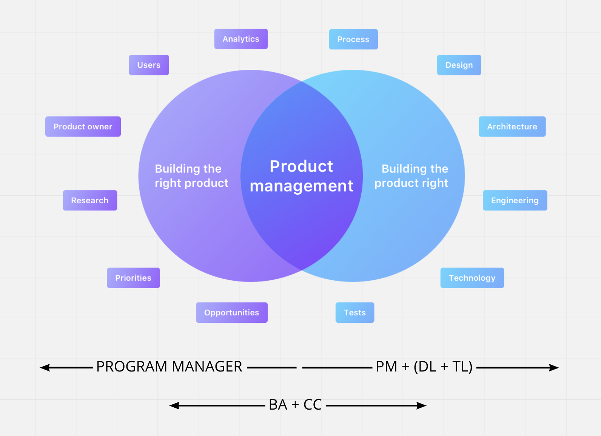

# Program Manager (PgM)

### Definition&#x20;

### Responsibility

Below is the list of responsibility of Program Manager, side by side with PM responsibility to show clear relationship and collaboration between PgM and PM:

|     |                                                                                | PgM |  PM |
| :-: | ------------------------------------------------------------------------------ | :-: | :-: |
|  1  | Keeps backlogs organized                                                       |     |  v  |
|  2  | Shield the team from unnecessary distraction                                   |     |  v  |
|  3  | Create a comprehensive timeline                                                |     |  v  |
|  4  | Giving assignment to team member                                               |     |  v  |
|  5  | Set clear project priorities                                                   |  v  |     |
|  6  | Set clear task priorities                                                      |     |  v  |
|  7  | Tracking progress of each members                                              |     |  v  |
|  8  | Escalate issues to upper managers                                              |     |  v  |
|  9  | Maintain smooth relationship with clients, external partners, and team members |  v  |  v  |
|  10 | Ensure deliverable has premium quality                                         |  v  |  v  |
|  11 | Create and maintain comprehensive project documentation                        |     |  v  |
|  12 | Create and send MoM                                                            |     |  v  |
|  13 | Review MoM before sending out                                                  |  v  |     |
|  14 | Manage project cost                                                            |     |  v  |
|  15 | Manage project profitability                                                   |  v  |     |
|  16 | Ensure punctuality of task delivery                                            |     |  v  |
|  17 | Ensure punctuality of project delivery                                         |  v  |     |
|  18 | Manage clients' expectation                                                    |  v  |     |
|  19 | Make decision on project                                                       |  v  |     |
|  20 | Create project quotation                                                       |  v  |     |
|  21 | Sending quotation to client                                                    |     |     |
|  22 | Testing out final delivery before sending out to client                        |  v  |  v  |
|  23 | Understand high level end to end flow of the projects                          |  v  |  v  |
|  24 | Understand client's business side of the projects                              |  v  |     |
|  25 | Understand detailed features specification                                     |     |  v  |
|  26 | Make efforts to prolong customers' life time value                             |  v  |     |

