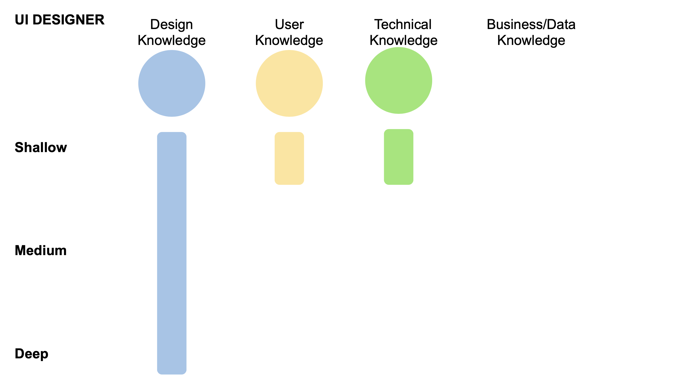
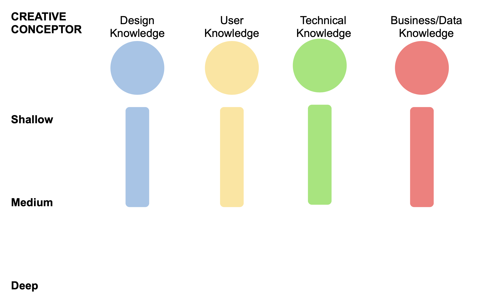

# Designer

Di section ini lebih dibahas apa saja yang harus dipunyai oleh masing-masing roles

## UI Designer

sebagai UI designer kamu harus:

* Mempunyai pondasi knowledge yang kuat di prinsip-pirinsip design/visual
* Bisa meng-implementasikan prinsip-prinsip design/visual tersebut pada real case
* Bisa memberikan rekomendasi terbaik terhadap suatu issue berdasarkan prinsip-prinsip design/visual yang ada
* Selalu mengupdate diri dengan knowledge terbaru terkait prinsip-prinsip design/visual

Tambahan yang harus kamu punya:

* Little amount knowledge of user
* Little amount knowledge of tech

Berikut sedikit visualisasi trait/character yang dibutuhkan oleh UI designer

Di luar ini tentu saja kamu harus bisa mempraktekkan/mengamalkan glory principles: [https://shrine.rollingglory.com/rolling-glory/principles](https://shrine.rollingglory.com/rolling-glory/principles)

## UX Designer/Researcher

sebagai UX designer kamu harus:

* Mempunyai pondasi knowledge yang kuat di Design Thinking & Human Centered Design
* Bisa meng-implementasikan prinsip-prinsip Design Thinking & HCD pada real case
* Curiosity dan Empathy yang tinggi pada user/customer needs & behaviour
* Mempunyai pondasi knowledge di User Research & Testing
* Pondasi knowledge yang kuat dalam membuat Prototype
* Selalu mengupdate diri dengan knowledge terbaru terkait prinsip-prinsip HCD

Tambahan yang harus kamu punya:

* Enough amount knowledge of Tech
* Little amount knowledge of Design/Visual

Berikut sedikit visualisasi trait/character yang dibutuhkan oleh UX designer:

Di luar ini tentu saja kamu harus bisa mempraktekkan/mengamalkan glory principles: [https://shrine.rollingglory.com/rolling-glory/principles](https://shrine.rollingglory.com/rolling-glory/principles)

## Creative Conceptor

Sebagai CC kamu harus:

* Mempunyai: enough amount knowledge of Design/Visual principle
* Mempunyai: enough amount knowledge of User behaviour principle
* Mempunyai: enough amount knowledge of Technical sides
* Mempunyai: enough amount knowledge of Business sides
* Mempunyai critical/analitycal thinking yang kuat

Tambahan yang kamu harus punya:

* Mempunyai pondasi knowledge yang kuat dalam membuat presentasi yang menggambarkan solusi

Berikut sedikit visualisasi trait/character yang dibutuhkan oleh Creative Conceptor:

Di luar ini tentu saja kamu harus bisa mempraktekkan/mengamalkan glory principles: [https://shrine.rollingglory.com/rolling-glory/principles](https://shrine.rollingglory.com/rolling-glory/principles)

