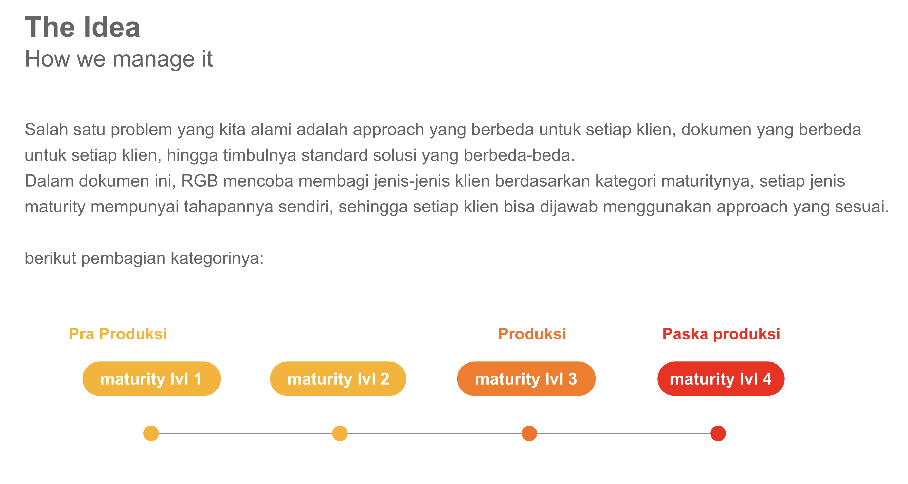
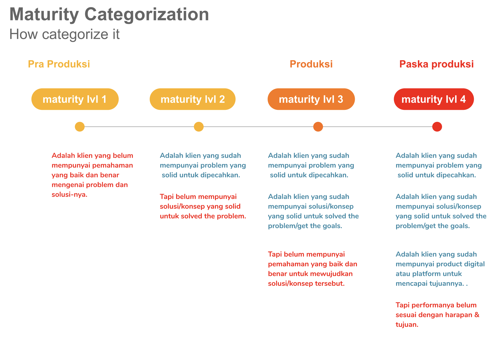
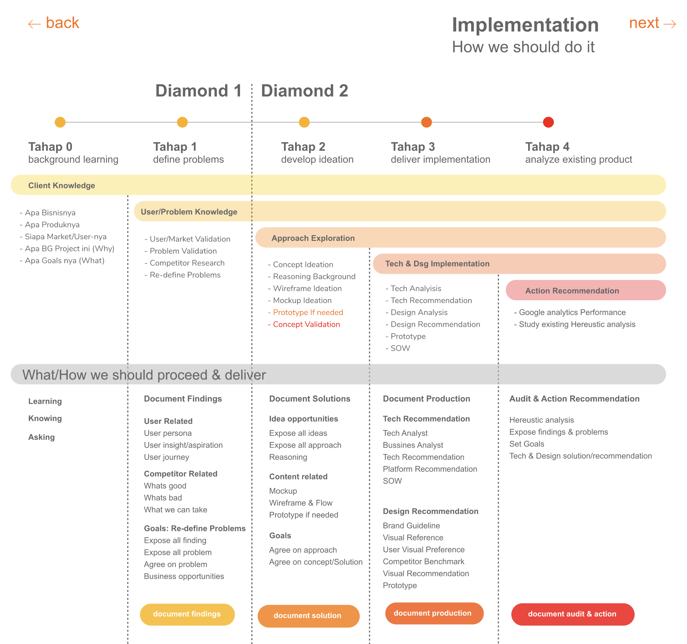
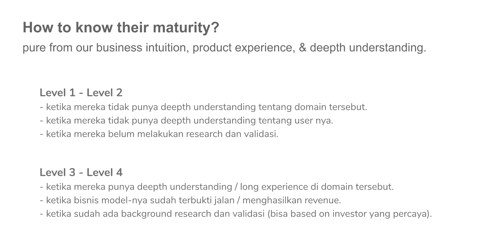
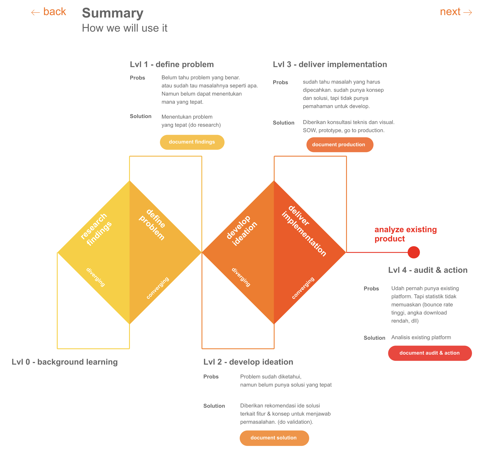
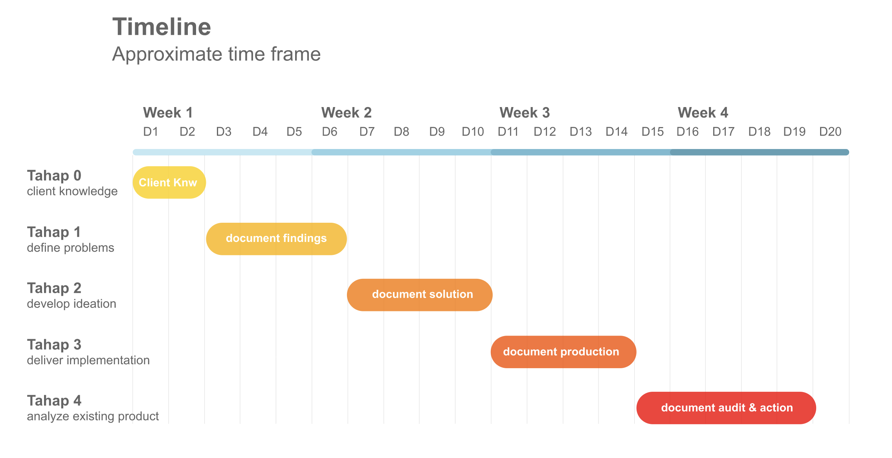

# Solution Pipeline & Guideline

### **Untuk Siapa Dokumen ini?**

Solution Pipeline & Guideline ini dibuat untuk Account Manager \(AM\), Creative Conceptor \(CC\),  Business Analyst \(BA\), Researcher, dan UX designer. Bila kamu adalah salah satu dari role diatas, maka kamu harus mempelajari dokumen di bawah ini.

### **Before we start.**

Solution Pipeline & Guideline ini diciptakan untuk mempermudahmu dalam menentukan apa saja langkah yang harus kamu lakukan ketika membuat Dokumen Solusi \(a.k.a menge-deal-kan sebuah project\). Harus berangkat dari mana, data apa yang harus ada/dicari, dan apa saja yang harus dipresent ke klien. Selain untuk keperluan Project \(Pandora\), Guideline ini juga bisa kamu gunakan setiap kali hendak membuat sebuah product baru.

### **The Fundamentals.**

Landasan dari dokumen ini dibuat adalah kenyataan bahwa klien yang datang ke Rolling Glory sangat beraneka ragam, dengan permasalahan dan kebutuhan yang beraneka ragam pula. Dalam dokumen ini, RGB membagi jenis-jenis klien berdasarkan kategorinya, dan setiap kategori klien bisa dijawab menggunakan tahapan solusi yang sesuai. Kamu bisa mempelajarinya secara lebih lengkap di dokumen berikut:

**Solution Pipeline & Guideline Document.**

Bila dalam pekerjaanmu kali ini kamu membutuhkan Design Audit, berikut guideline yang bisa membantumu:



### **The Output**

Nah sudah dapat gambaran secara umum mengenai proses di atas? Sekarang kamu bisa memulai melakukan prosesnya. Secara garis besar tugas kamu adalah mendapatkan insight dari bisnis klien, market, user, competitor, benchmark reference, dan teknologi terkini. Karena itu, ajaklah Account Manager, UX Designer, Tech Lead, atau siapapun yang bisa membantumu mendapatkan insight. Pada akhirnya kamu harus mendokumentasikan penemuanmu dalam sebuah dokumen yang kita sebut Document Solution/Recommendation atau Document Findings. Berikut contoh-contoh Document Solution dan Document Findings yang pernah dibuat oleh RGB: 

link Document solution

### **Reference & Knowledge terkait**

Untuk tambahan knowledge mengenai research, bisa kamu lihat di link berikut ya  [**Research Method**](https://drive.google.com/drive/folders/1S_vNfjITPgNk6o7NtMWJVLkbXLNLNl63?usp=sharing).

## 

