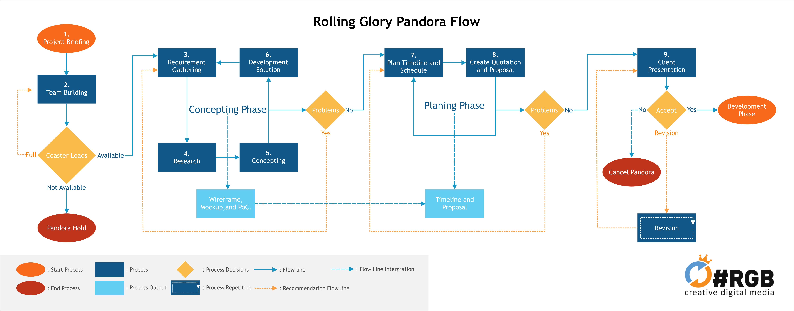
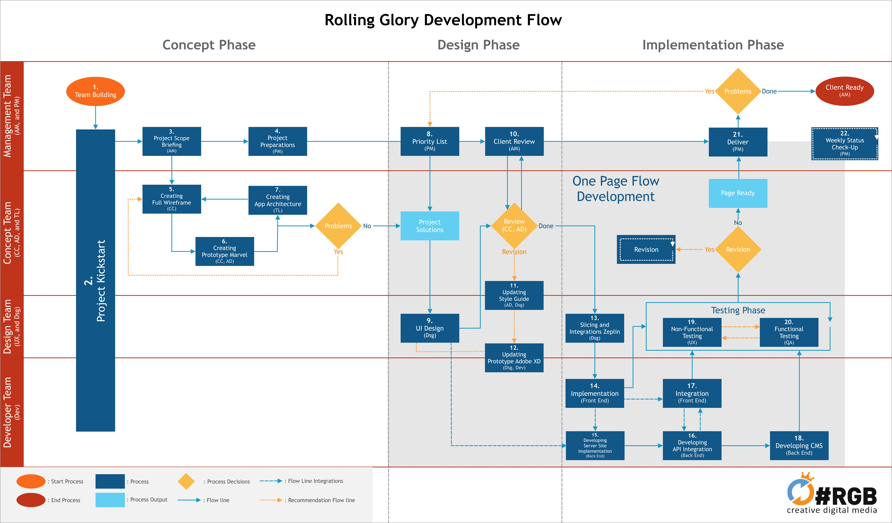

# Production Pipeline

## Fase Pandora / Pre-production

Fase Pandora adalah fase dari project sebelum masuk tahap development. Fase ini pada umumnya terjadi sebelum ada proses _deal_ spesifikasi maupun kontrak dengan client. Pengerjaan yang dilakukan adalah requirement gathering client, research, dan kemudian development calon solusi kepada klien—yang bisa diimplementasikan dalam bentuk proposal solusi yang disertai dengan mockup, wireframe, ataupun aplikasi proof of concept. Dalam project flow pengerjaan Pandora adalah pada early phase.

Fase Pandora/Pre-production biasanya berkaitan erat dengan Development Solution & Research. Untuk lebih lengkap mengenai Pipeline Solution, bisa dipelajari di sini:



## Fase Development / Production

Dalam Fase Development ada 3 proses yang dilakukan secara sekuensial maupun paralel sesuai dengan situasi dan kasus masing-masing project, yaitu: _concept phase_, _design phase_, _implementation phase_.

Rolling Glory menggunakan metodology agile dalam proses production ini.

