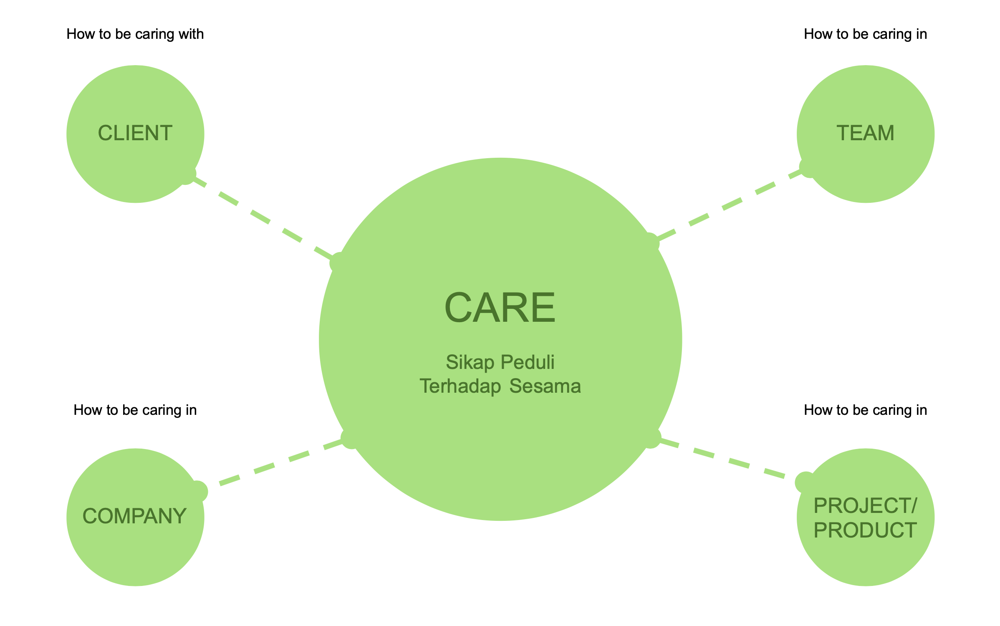
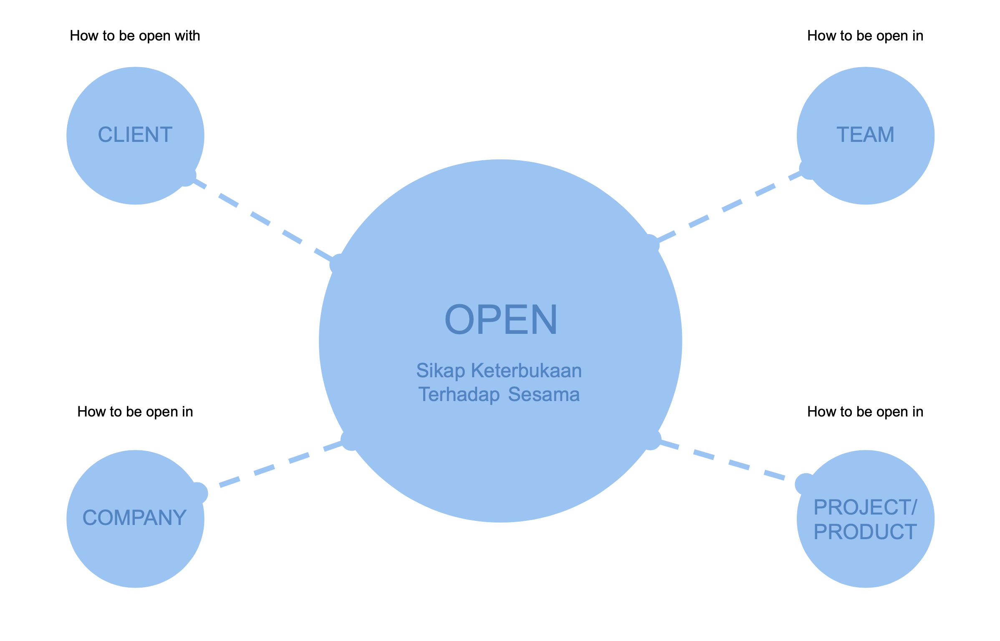
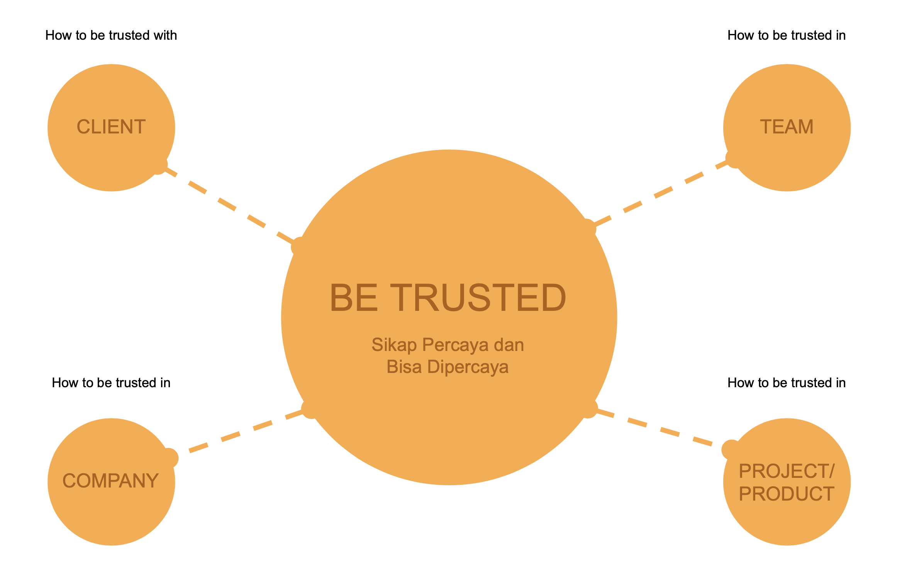
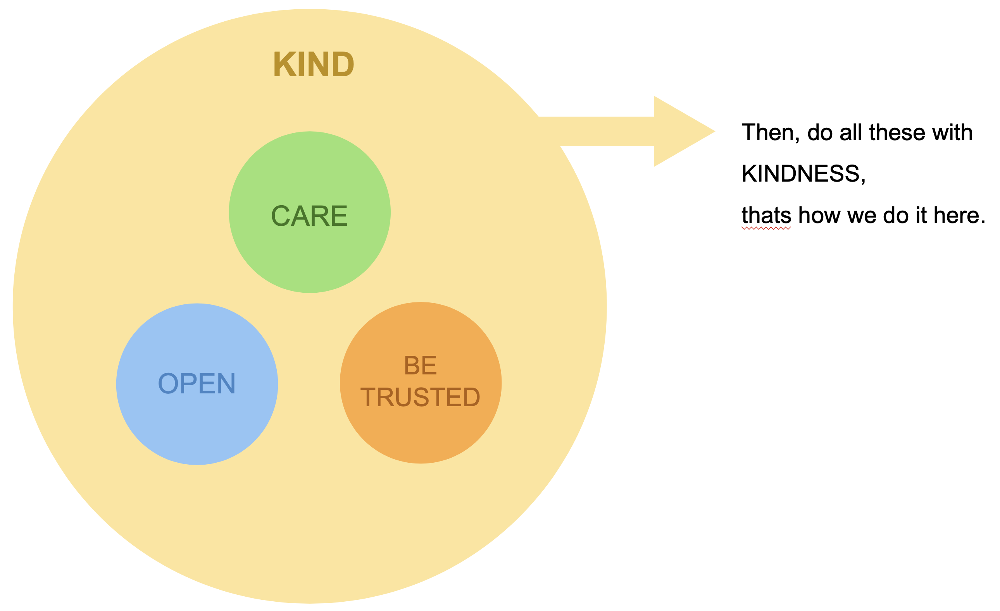

# Values

Untuk menjalankan misi dan mencapai visi, Rolling Glory memiliki 3 _values_ yang menjadi pedoman untuk seluruh coaster. Nilai-nilai ini harus selalu menjadi pedoman dalam kehidupan sehari-hari di studio secara sosial maupun profesional dan juga menjadi pedoman saat berhubungan dengan pihak luar seperti klien, partner, dan komunitas.

_Values_ dari Rolling Glory adalah:&#x20;


1. Kindness & Care
2. Openness
3. Mutual Trust - _Trust & Can be Trusted_


### Kindness & Care

Value kindness & care sangat penting untuk bisa menciptakan sebuah atmosfer yang positif dan kondusif.

Dengan value kindness, coaster diharapkan untuk bisa tetap bisa _kind_/baik hati di berbagai situasi, terutama ketika situasinya kurang kondusif. _Kindness_/kebaikan hati ditentukan dari kemampuan kita untuk bisa ramah, murah hati, dan tenggang hati (_considerate_) ketika situasi tidak mendukung dan menantang kita untuk melakukan hal-hal yang tidak _kind_.

Dengan value care, coaster diharapkan untuk bisa peduli kepada diri sendiri (_self-care_), peduli ke sesama coaster, peduli ke lingkungan kerja, peduli ke task yang sedang dikerjakan, peduli kepada klien/partner, hingga peduli kepada _user_ yang akan menggunakan produk yang dibuat Rolling Glory.

### Openness

Openness bermakna terbuka dalam berkomunikasi dan juga berpikiran terbuka (_open minded_).&#x20;

Komunikasi adalah salah kunci dalam bekerja bersama tim, dengan komunikasi yang baik, tim akan bisa kokoh dan memiliki resultan gaya yang maksimum untuk mencapai tujuan yang mau dicapai. Dengan value openness ini, coaster diharapkan bisa mengkomunikasikan apapun yang perlu dikomunikasikan walaupun mungkin itu bukan hal yang baik atau mudah disampaikan.

Berpikiran terbuka bermakna coaster bisa menerima pendapat dan perbedaan dengan orang lain dengan baik dan membuka pemikiran untuk perspektif-perspektif baru.

### Mutual Trust

Kepercayaan adalah lem terbaik dalam menjaga hubungan antar-manusia agar tetap kuat. Di Rolling Glory setiap coaster percaya satu sama lain akan selalu berusaha yang terbaik.

Kepercayaan ditentukan dari sifat-sifat seperti memiliki tanggung jawab, berintegritas, dan dapat diandalkan.

## Applying Values on Daily Bases

Knowledge hanyalah sebuah knowledge sampai dia dipahami, tetapi pemahaman (understanding) juga hanyalah sebuah pemahaman sampai dia di-amalkan/dilakukan.&#x20;

Berikut **"**beberapa contoh/panduan" pengamalan value di RGB:

### **Care in Team:**&#x20;

**Memahami dan mengerti bahwa kita tidak bekerja sendirian.**

* Sigap/responsif memberikan jawaban ketika ada pihak lain yang bertanya/memerlukan penjelasan.
* Sigap memberikan informasi ke tim apabila ada masalah atau kendala.

**Mengerti dan peka terhadap situasi tim/sesama**

* Aktif bertanya apabila merasa/melihat ada coaster yang mengalami kesulitan.
* Menawarkan bantuan apabila ada seseorang yang membutuhkan bantuan.

**Give Help**

* Siap sedia membantu tim ketika dibutuhkan, terutama pada project yang sedang dipegang.

### **Care in Project/Product:**&#x20;

**Memahami dan mengerti apa yang hendak dibuat dan bagaimana mencapainya.**

* Aktif mengikuti daily/weekly meeting agar selalu terupdate dengan milestone dan tujuan bersama.&#x20;
* Aktif memastikan apakah pekerjaan yang sudah dilakukan sudah sesuai dengan kebutuhan/keinginan/brief/kontrak.

**Memahami dan mengerti siapa pengguna produk, bagaimana mereka menggunakannya dan untuk apa produk ini dibuat.**

* Aktif bertanya dan mencari tahu apabila ada hal yang kurang dipahami. (bukan pasif dan asal pekerjaan selesai).

### **Care in Company:**&#x20;

**Memahami dan mengerti tujuan RGB dan bagaimana kita akan mencapainya.**

* Aktif bertanya ketika ada arahan/keputusan yang muncul dari perusahaan.

**Actively raise idea & issue**

* Aktif raise issue ketika melihat ada hal-hal yang dilihat tidak sesuai dengan arahan, dan tidak ragu mengutarakan ide/solusi.

### **Care with Client:**&#x20;

**Memahami dan mengerti problem klien.**

* Aktif bertanya/berdiskusi dengan klien (atau AM) dalam rangka memahami bahwa memang problem ini yang mau di address
* Membantu klien untuk melihat permasalahan lagi secara lebih luas.

**Memahami dan mengerti tujuan & keinginan klien.**

* Aktif bertanya/berdiskusi dengan klien bahwa memang goal ini yang mau dicapai dan cara ini yang terbaik untuk mencapai goal tersebut,
* Membantu klien dalam melihat tujuan tersebut secara lebih luas dan memberikan alternatif-alternatif jalan yang mungkin bisa diambil.

****

### **Openness in Team:**&#x20;

**Speak up idea**

* Berani menyampaikan idenya, apabila mempunyai ide yang dirasa bagus (ataupun ganjalan) untuk tim dalam suatu pekerjaan.

**No hard feeling**

* Bisa menerima/memahami apabila ada perbedaan pendapat&#x20;
* Bisa memahami kalau ide yang disampaikan, pada akhirnya tidak bisa diimplementasikan oleh tim.&#x20;
* Tidak berhenti memberikan pendapat karena ini.

**Advance notice**

* Memberi informasi jauh hari apabila ada kendala, sehingga solusi cadangan bisa disiapkan bersama tim.

### **Openness in Project/Product:**&#x20;

**Always Beta**

* Memahami bahwa product/project yang dikerjakan ini selalu mempunyai ruang yg cukup untuk dieksplorasi.
* Terbuka dengan masukan/ide/improvement/kritik terhadap product/project yang sedang dikerjakan meskipun masukan tersebut dirasa berbeda.&#x20;

**Actively asking question about the product (curious)**

* Aktif/berani bertanya, untuk mendalami (atau kurang mengerti) mengenai product/project yang sedang dikembangkan.

### **Openness in Company:**&#x20;

**Speak up in good and bad**

* Berani menyampaikan idenya dengan baik ke leader/manager/hokage, apabila dirasa idenya itu sejalan dengan visi-misi RGB.
* Berani menyampaikan/mendiskusikan masalah yang terjadi ke leader/manager/hokage, apabila yang dilihatnya itu tidak sejalan dengan visi-misi RGB.

**No speak behind**

* Berani bertanya apabila tidak memahami arti kebijakan yang ada di RGB.
* Tidak menyimpan masalah atau gagasan dalam diri/circle nya sendiri, tetapi berani menyampaikannya ke leader/manager/hokage untuk bersama mendiskusikan jalan keluarnya.

### **Openness with Clients:**&#x20;

**Menjadi teman diskusi yang baik**

* Terbuka dengan segala masukan, input, pertimbangan dari pihak klien.&#x20;
* Bisa memberikan saran yang saling membangun demi tercapainya tujuan bersama.

**Honest and gives notice**

* Selalu memberi tahu/raise sebelumnya ketika diketahui akan terjadi sesuatu yang urgent. (jangan menutup-nutupi/terlambat dalam memberikan update/berita).

### **Be Trusted in Team:**&#x20;

**Be there**

* Ada dan mudah dihubungi oleh tim, terutama pada jam kerja.

**Admit when we dont know**

* Tidak perlu malu mengakui bahwa kita tidak tahu, ketika berani mengakui kita tidak tahu, tim bisa membantu mencari jalan keluar bersama. Less harmful than we suggest something wrong.

**Give help**

* Siap sedia membantu tim ketika dibutuhkan, terutama pada project yang sedang dipegang.

### **Be Trusted in Project/Product:**&#x20;

**Meet the Dates**

* Mampu menyelesaikan task sesuai dengan waktu yang sudah disepakati.

**Meet the Qualities**

* Selalu berusaha menyelesaikan pekerjaan agar sesuai dengan standard kualitas yang terbaik.

### **Be Trusted in Company:**&#x20;

**Know our Mission**

* Memahami dan mengerti visi-misi yang RGB bawa, dan mampu melaksanakannya dengan baik.

**Meet the Rules**

* Memahami dan mengerti rules yang ada di RGB, dan mampu melaksanakannya dengan baik.

### **Be Trusted with Clients:**&#x20;

**Honest & Open**

* Berani benyampaikan suatu informasi atau  issue/problem jauh-jauh hari sebelumnya.

**Admit when we're wrong & say sorry**

* Berani mengakui kesalahan dan meminta maaf bila memang kesalahan ada pada kita. Bukan menghindar, blaming, atau mencari-cari alasan.

