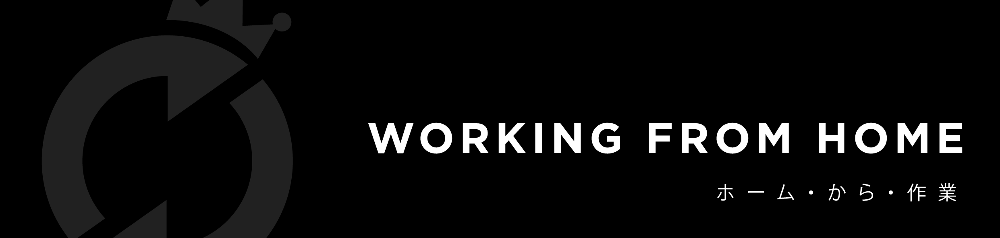

# Best Practice

Ada kalanya, situasi mendesak kita untuk bekerja di rumah atau remote. Jika saat itu tiba, tentunya ada perubahan yang harus kita lakukan terkait dengan cara kita bekerja. Halaman ini ditujukan untuk bersama-sama berbagi mengenai hal-hal yang perlu dipertimbangkan saat working from home.

## Setting Context

Rolling Glory selalu memperhatikan kesehatan dan kenyamanan Coasters. RGB juga memberikan fleksibilitas untuk jam dan tempat kerja para Coasters selama mereka bertanggung jawab dengan pekerjaan masing-masing. Secara pipeline, RGB sudah memiliki alur kerja yang clear dengan adanya para leader,  dan manager. Selama ini alur komunikasi RGB sudah cukup memadai menghandle semua obstacle yang mungkin terjadi. \
\
Dokumen ini akan membahas limitasi yang mungkin akan terjadi selama kita WFH. Mari kita mulai dengan visi yang sama mengenai WFH yaitu; \
_Pada kondisi yang serba tidak pasti ini, Coasters mungkin tidak ada dalam kondisi optimal dan produktif. Banyak hal yang akan menganggu mereka seperti rasa cemas akan keluarga dan kondisi yang tidak ideal ini. WFH sangat memerlukan akuntabilitas, empati dan trust yang dalam. Be mindful, this is a stressful time for everyone. Be kind and trust your colleague._

## The Right Environment

Perlu disadari bahwa WFH mungkin membuat working space kamu menjadi tidak ideal. Akan banyak distraksi dan gangguan dari keluarga yang tidak terbiasa melihat kamu sedang bekerja di rumah. Maka dari itu, menyiapkan working space menjadi penting. Bekerjalah di tempat yang punya pencahayaan yang cukup dengan distraksi yang minimal. Kalau bisa gunakan meja dan kursi untuk kenyamanan bekerja. \
\
Komunikasikan jam kerja kalian kepada keluarga. Beri tahu mereka bahwa pada jam kerja, sebisa mungkin tolong jangan diganggu. WFH juga akan menuntuk kalian untuk melihat screen device/gadget kalian lebih lama karena meeting yang biasa tatap muka akan digantikan dengan menatap layar. Untuk itu, keep in mind untuk selalu beristirahat sejenak setiap 2 jam untuk memberikan mata kalian istirahat. Saat beristirahat sejenak ini kalian bisa lakukan stretching atau menyapa keluarga kalian sejenak.

## The Right Tools

Pastikan kamu mempersiapkan alat komunikasi dan kordinasi dengan baik. Cek webcam dan microphone laptop atau device lainnya. RGB menggunakan Proofhub sebagai task manager. Yang lebih penting, RGB sudah membuat **** [**WFH tracker**](https://docs.google.com/spreadsheets/d/1XyLhBMTfNgZSVWXGVxKEnrI5OwOTKInjL7qiaaKH4JU/edit#gid=0) yang harus kamu update setiap saat ya. Untuk hal-hal lainnya silahkan intip [**WFH best practice**](https://docs.google.com/document/d/1TPAKV-AowBpODVul5cL73mKN5caN6RQf0wvV\_6O5Ees/edit) dari kantor tetangga. Nah selain itu, dalam kondisi seperti ini biasakan untuk selalu:\
\
**Usahakan Selalu Update**\
****Sudah kita beberapa kali singgung bahwa komunikasi adalah koentji, jadi pastikan semuanya terkomunikasikan dengan baik. Bahkan hal-hal kecil seperti mau mandi, sedang makan siang, atau lurusin punggung. Selalu komunikasikan ke [**WFH Tracker**](https://docs.google.com/spreadsheets/d/1XyLhBMTfNgZSVWXGVxKEnrI5OwOTKInjL7qiaaKH4JU/edit#gid=0) ya.

**Document Everything**\
****Pastikan semuanya tertulis. Setiap revisi, setiap update, setiap keputusan tertulis dengan baik. Tidak terbiasa? Chat history bisa jadi source buat kamu trace back. Gunakan juga fasilitas yang bisa diakses bersama seperti google docs, dll.

**Selalu Set Konteks dalam Sebuah Diskusi**\
****Saat berdikusi dengan tim, kita akan mudah sekali untuk kehilangan sebuah konteks. Solusinya adalah selalu pergunakan bantuan visual. Kalian bisa gunakan video call atau share screen dalam diskusi. Idealnya diskusi dilakukan dalam video call, internet bermasalah? Turunkan menjadi call, atau turunkan menjadi chat.\
\
_Pro tip: Set default microphone dan webcam kalian dalam keadaan off atau mati. Kita tidak pernah tau apa yang akan terjadi di muka umum haha._

## The Right Mindset

WFH ini bisa membuat merasa kita jauh dari orang lain. Perubahan ini mungkin bisa sangat menjengkelkan bagi beberapa orang. Kembali lagi untuk selalu _be respectful and considerate,_ semua orang sudah melakukan yang mereka bisa. Transparansi menjadi kunci, perhatikan detail setiap orang seperti jam berapa orang tersebut mulai bekerja, apa yang mereka sedang kerjakan dan seberapa banyak load pekerjaan mereka. \
\
Jika dirasa tidak memiliki momen yang pas untuk berdiskusi dengan tim, catatlah terlebih dahulu apa saja yang akan kamu diskusikan dan set reminder untuk kembali beberapa saat lagi.

## WFH Hacks

1. Jika dirasa fokus kamu mulai berkurang, istirahatlah sejenak. Ngemil atau strecthing jangan lupa ya.
2. Jangan lupa makan. Jangan. Lupa. Makan.
3. Jangan lupa minum. Jangan. Lupa. Minum.
4. Buatlah grup untuk nyampah, dalam hal ini kamu bisa join discord RGB dan rikues lagu di Townhall, cheers.
5. Saat diskusi, coba selipkan 1-2 candaan, biar ga tegang tegang amat.
6. Jangan lupa berinteraksi dengan keluarga atau orang tersayang ya.
7. Beri apresiasi tim kalian, sapa mereka setiap pagi, tanyakan kondisinya dan berterima kasih di akhir jam kerja.

## Useful Links

Terakhir, seperti yang sering kita sampaikan untuk stay healthy, productive and keep updated. Berikut adalah link rekomendasi bacaan untuk selalu aware situasi terkini.\
\
[**Aku adalah link tersebut.**](https://drive.google.com/drive/u/1/folders/1MiYe4G8aq2Q-TSYxjNFZ3z0GuadJ2yIz)****
